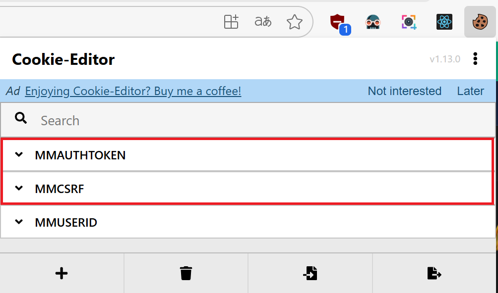
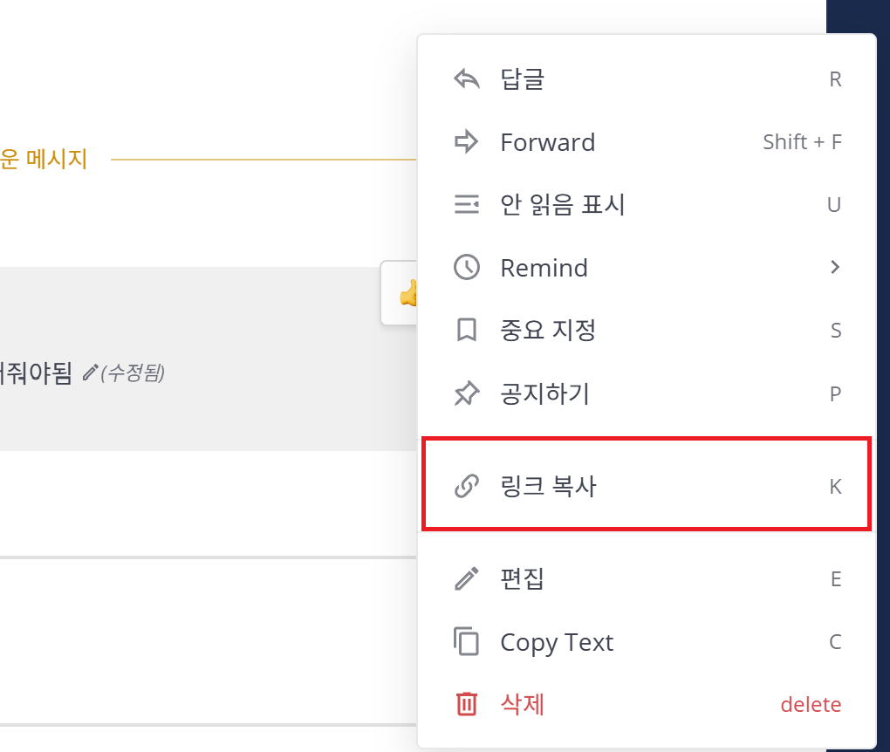

# Mattermost Reaction Tools

MatterMost에 댓글 반응을 연속적으로 빠르게 달아줍니다.

## 실행법

### 1. 설치

```bash
cd tools/mm-reaction-web
npm install
```

### 2. 토큰 확인

브라우저로 Mattermost에 로그인하여 확장프로그램이던 뭐던 토큰값을 확인해서 `.env`에 넣던 웹상에서 넣던 합니다.



### 3. 서버 실행

```bash
cd tools/mm-reaction-web
npm start
```

### 4. 댓글 ID 복사

댓글의 ID를 복사하여 Post ID에 붙여넣기 합니다.



## 기능

채널에 있는 이모지를 검색하여 프리셋으로 저장해 둘 수 있습니다.


여러분의 창의력을 발휘해서 상대를 깜짝 놀라게 반응을 추가해 보세요!

## 주의사항

`.env.example`은 뒤에 `example`을 지우고 `.env`로 이름을 바꿔 사용하세요.

